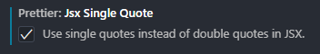
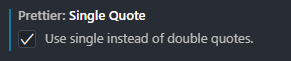
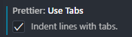
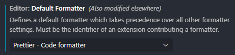

# -quiz-gghlo

# How to use this locally

## Prerequisites

Our project uses Express.JS with Typescript and Node. These are the versions we're running which can be installed with `npm install`:

- Express: 4.17.21
- Node: 20.12.12
- Typescript: 5.4.5

## Installation

Here are instructions for how to install this locally on the repo:

1. Clone the repo

```
git clone https://github.com/fac29/-quiz-gghlo
```

2. Install NPM packages

```
npm install
```

3. Enter the following script to create the `build/index.js` and runs the server.

```
npm start
```

# API Endpoints

These are our endpoints and how we're using them.

| URI            | HTTP Method | POST body   | Result                                                                                                        |
| -------------- | ----------- | ----------- | ------------------------------------------------------------------------------------------------------------- |
| /              | GET         | empty       | Show categories of questions and number of questions in those categories (currently returning whole database) |
| /questions     | GET         | JSON string | Submit category and difficulty to filter by                                                                   |
| /questions     | POST        | JSON string | Category, difficulty, questions, options and answer. Timestamp and id are generated automatically             |
| /questions/:id | PUT         | JSON string | Update existing question with favouriting?                                                                    |
| /questions/:id | DELETE      | JSON string | Delete existing question                                                                                      |

## Using endpoints

To use the endpoints, you will need to install Postman or Bruno and then do the following:

Server path: http://localhost:3210/

1. GET
   In order to retrieve questions, you can retrieve the whole database or optionally filter by category, difficulty and number of questions. For example, you can use the following path to find easy Science questions: http://localhost:3210/questions?category=Science&difficulty=easy&questions_number=1

   You should receive the following result:
   ```
    [
        {
            "id": 1,
            "category": "Science",
            "difficulty": "easy",
            "question": "What is the chemical symbol for Hydrogen?",
            "options": [
                "H",
                "He",
                "Hy",
                "Ho"
            ],
            "answer": "H",
            "favourited": true,
            "timestamp": "2023-04-01T10:00:00Z"
        }
    ]
   ```
   
3. POST
  In order to create/add questions, you should use this endpoint: http://localhost:3210/questions/

  Note that id, timestamp and favourited are automatically generated. In future it would be useful to add means to favourite a created question at the point of creation.

  Here is an example question object you can submit in the POST body:
  ```
  {
			"category": "History",
			"difficulty": "easy",
			"question": "When was Princess Diana born?",
			"options": ["01/07/1998", "07/07/1998", "02/02/1961", "09/09/1990"],
			"answer": "02/02/1961",
		}
  ```

5. PUT
  In order to update existing questions, you should use this endpoint: http://localhost:3210/questions/:id

  Here is an example object you can submit in the PUT body:
  ```
  {
      "id": 31,
      "category": "History",
			"difficulty": "easy",
			"question": "When did Princess Diana die?",
			"options": ["01/07/1998", "07/07/1998", "02/02/1961", "09/09/1990"],
			"answer": "07/07/1998",
		}
  ```
   
7. DELETE
   In order to delete existing questions, you should use this endpoint: http://localhost:3210/questions/:id

   Here is an example path you can submit on Postman/Bruno: http://localhost:3210/questions/31

   When you check data.json, the question should no longer be there.

# Testing our code works

We used Postman to test our endpoints. You can find the local and server tests [here](!https://www.postman.com/halimahexe/workspace/local-project-1-quiz-ggho/collection/35077866-90f84f28-42ea-4834-89d5-af30f72965e7?action=share&creator=35077866).

You will need to set up the following global environment variables:
```js
Local Host: http://localhost:3210/
AWS: https://13.60.83.197:2345/
```

# Prettier configuration

We are using Prettier to ensure our codebase is formatted in the same way and avoid conflicts.

To access Prettier settings on VSCode, go to Settings > Search for 'prettier'

The following are settings we've updated from the default:









# User stories

As a **quizzer**, I want to:

- Select a subject area for my quiz.
- Begin a quiz session with randomly generated questions.
- View a summary of my quiz results, including areas of strength and weakness.
- Add, edit, and delete quiz questions and answers.

- https://drive.google.com/file/d/16tOZ-KAU32farRAmBqDaiYN2LxSPcVan/view?usp=sharing
